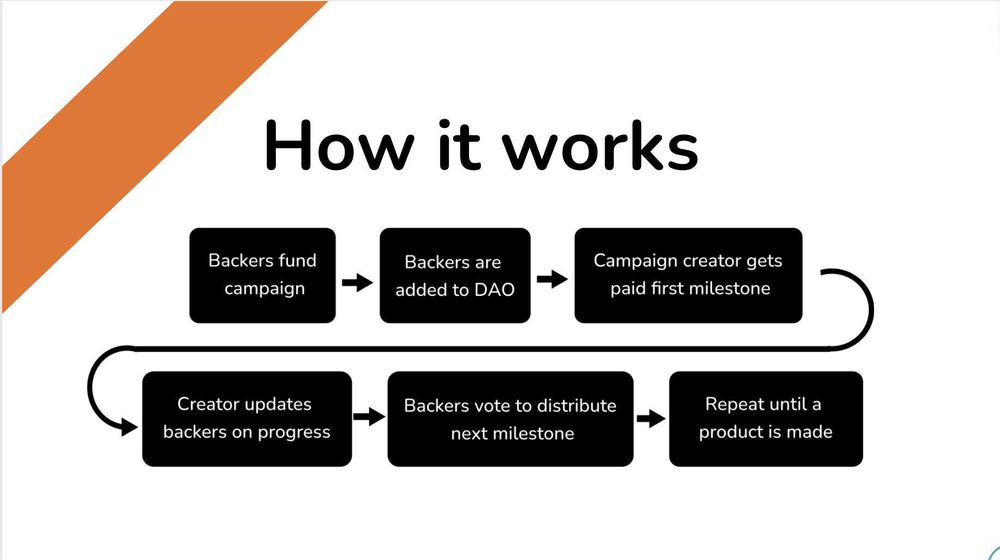

An innovative take on crowdfunding leveraging blockchain technology to allow for better transparency and prevent frauds

## How it works



After backers fund a campaign they are added to a DAO. This DAO has oversight over the project and can "freeze" the project at any time if the campaign creator is determined to be a bad actor. In addition to that they also check over updates from the creator and can choose whether or not to distribute the rest of the funds depending on their progress reports. This model is in stark contrast from the current crowdfunding model where, upon the completion of funding, all of the raised funds are transferred to the creators bank account with zero oversite. Backers just have to hope they aren't getting scammed and if they do that the platform will help them out. Raized removes this trust by putting the power in the hands of the backers themselves.

## How to run

After cloning the repo

```
cd server
npm i
npm run dev
```

Then in a new terminal

```
cd client
npm i
npm run dev
```